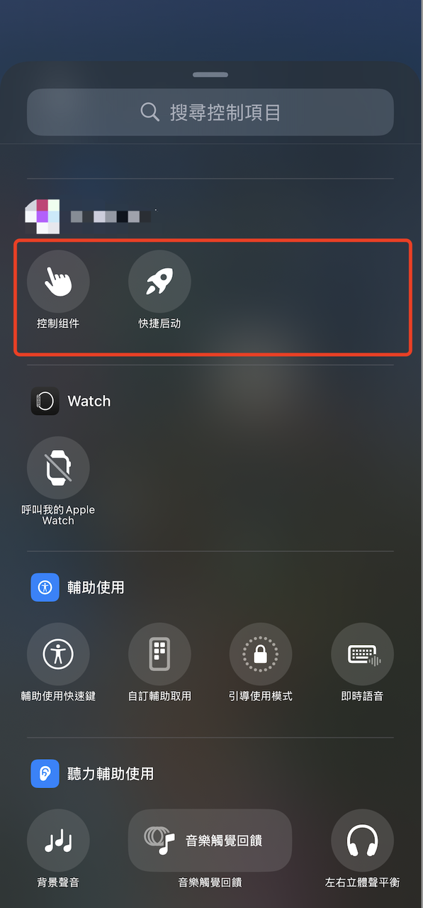
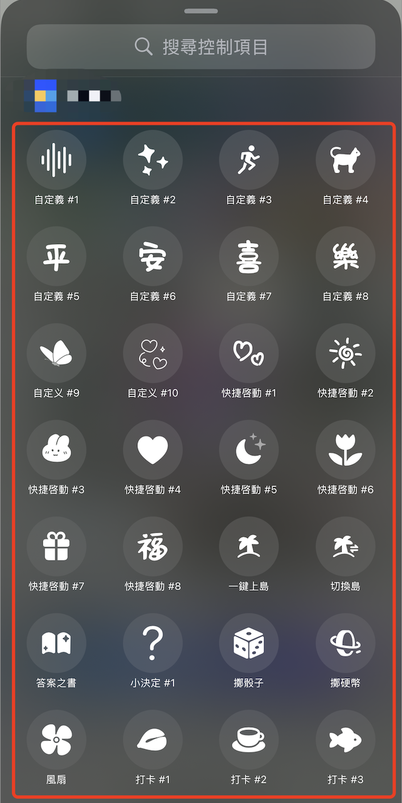

随着iOS18的推出，Apple开放了控制中心的相关功能，将命名为ControlWidget。随着这一功能的推出，不但官方提供相关的视频和示例代码，也有很多技术博客出了很多相关的技术文章和视频。


目前网上提供的教程和视频都是基于ControlWidgetToggle和ControlWidgetButton两个控件的最基本的功能出的教程。开发者如果参照现有的教程，最多只能实现一个Demo和极简的产品，但要实现复杂产品化，还是有很多的坑是需要去填的。


用已经上线的两款产品来说明，目前在控制中心页面的两种典型的控制方式:

* 控制项目只展示ControlWidgetToggle和ControlWidgetButton 通过配置化方式选择不同的控制功能



* 将全部的控制功能全部展示出来，每一个控制项对应一个控制功能



> 第二种方式实现比较简单，参照官方视频和示例代码就能够实现，但目前主流都是采用的第一种方式来实现，后续会更容易进行更多控制功能的扩展开发。以下内容是基于第一种方案的实现。

***

# ControlWidget到底能实现什么功能

* 点击可以打开其它的应用

* 点击可以运行指定的快捷指令

* 点击可以打开指定的网页

* 使用一个风扇图标，点击后在旋转和不旋转间切换

* 使用一个木鱼图标，点击后图标实现点击动画、可播放声音

* 点击后实现震动效果

* 点击后更换图标及文字

* 点击后可以打开实时活动(灵动岛)

通过实现以上的几个功能点，就能在产品上实现很多好玩的东西，这些特色玩法，可以自行在自媒体上搜索到。

# ControlWidget开发软、硬件需求

* Mac系统需要升级到最新版本

* Xcode版本需要升级到最新版本

* 需要一部能够升级到iOS18.0的iPhone，为了有更好的效果，最好是14Pro以上机型


# ControlWidget开发技能要求

* 需要掌握swift开发语言

* 需要掌握swiftUI开发

* 需要了解WidgetKit开发框架

* 需要了解ActivityKit开发框架

* 需要了解自定义的SF图标的制作——ControlWidget的图标只支持SF，如果你全部使用系统的SF图标，这项技能不是必须


# ControlToggleWidget开发代码实现

代码中 \*\*\* 且标注颜色为红色，为踩坑点

ControlToggleWidgetIntent.swift  点击控制组件的交互在此类处理

```swift
@available(iOS 18.0, *)
struct ControlToggleWidgetIntent:SetValueIntent,LiveActivityStartingIntent {

    static var title: LocalizedStringResource = "ControlToggleWidgetIntent"
    
    @Parameter(
        title: .init("widgets.controls.parameter.value", defaultValue: "value")
    )
    var value: Bool
    
    
    
    @MainActor
    func startLiveActivity(){
        
        do {
            let _ = try Activity<ControlExtAttributes>.request(attributes: ControlExtAttributes(name: "Demo"), contentState:ControlExtAttributes.ContentState(emoji: "🤩") ,pushType:.none)
        } catch let error {
            /// ***直接调用会直接抛出出异常 ActivityKit.ActivityAuthorizationError.unsupportedTarget
            /// ***需要在Info.Plist里配置 Supports Live Activities  True
            debugPrint("开启灵动岛失败:\(error)")
        }
    }
    
    @MainActor
    func perform() async throws -> some IntentResult {
        // 此处实际业务处理
        // 开启灵动岛、播放声音、开启振动等
        
        // 如果有使用到开启LiveActivity 这个数据管理类的数据需要做持久化处理，否则value会一直变化,出现不可预知的异常
        ControlToggleWidgerValueManage.shared.value.toggle()
    
        // 开启灵动岛
        self.startLiveActivity()
        
        return .result()
    }
    
}
```

ControlToggleWidgerValueManage.swift 数据管理实现类

```swift
class ControlToggleWidgerValueManage: NSObject {
    

    static let shared =  ControlToggleWidgerValueManage()
    
    var value:Bool = false
    
    /// 实际业务所有数据都需要持久化
    

}
```

ControlToggleWidget.swfit 入口文件

```swift
@available(iOS 18.0, *)
struct ControlToggleWidget: ControlWidget {
    static let kind = "com.xyj.ios.MuWaWidgets.control.toggle"
    var body: some ControlWidgetConfiguration{
        AppIntentControlConfiguration(kind: ControlToggleWidget.kind, provider: ControlWidgetToggleProvider()) { item in
            
            // 开启状态的图标颜色
            let themeColor = Color.orange
        
            ControlWidgetToggle(isOn:ControlToggleWidgerValueManage.shared.value, action:ControlToggleWidgetIntent()) {
                // 实际是一个Lable 可自适应实际小、中、大三种尺寸
                // 使用的文字和图标可以通过 item.entity 去关联一个数据模型，从数据模型取
                Label {
//                    Text("标题")
                    Text(item.entity.title ?? "标题")
                    Text("副标题")
                } icon: {
                    ///  此处图标使用实际业务对应的SF图标
                    // 系统SF图标
//                    Image(systemName: "figure.walk")
                    // 自定义SF图标
                    Image("icon_control_katong_1")
                }

            }.tint(themeColor) // 设定开启状态的图标颜色
        }.displayName("控制组件")
            .description("选择自定义组件")
            .promptsForUserConfiguration()
    }
}
```

ControlWidgetToggleProvider 配置意图类&#x20;

```swift
extension ControlToggleWidget{
    
    struct ControlToggleItem{
        let entity:ControlWidgetToggleEntity
    }
    
    struct ControlWidgetToggleProvider:AppIntentControlValueProvider{
        
        
        func currentValue(configuration: ControlToggleWidgetConfiguration) async throws -> ControlToggleItem {
            return item(configuration: configuration)
        }
        
        
        func previewValue(configuration: ControlToggleWidget.ControlToggleWidgetConfiguration) -> ControlToggleWidget.ControlToggleItem {
            return item(configuration: configuration)
        }
        
    
        private func item(configuration: ControlToggleWidgetConfiguration) -> ControlToggleItem{
            .init(entity: configuration.entity ?? ControlWidgetToggleEntity(id: UUID().uuidString, uuid: "11111"))
        }
    
    }
    
    struct ControlToggleWidgetConfiguration: ControlConfigurationIntent {
        init() {
            
        }
        static var title: LocalizedStringResource = .init(
            "widgets.controls.ControlWidgetDemoConfiguration.toggle.title",
            defaultValue: "控制选项"
        )
        
        
        static var openAppWhenRun: Bool = true
        
        
        @Parameter(
            title: .init("widgets.controls.ControlWidgetDemoConfiguration.toggle.data", defaultValue: "控制选项")
        )
        var entity: ControlWidgetToggleEntity?
        
        
        @MainActor
        func perform() async throws -> some  IntentResult{
            return .result(value: entity)
        }
    }
}

```


ControlWidgetToggleEntity  ControlWidgetToggleEntityQuery 配置列表实现

```swift
// 自定义控制中心选择列表
@available(iOS 18.0, *)
struct ControlWidgetToggleEntity: AppEntity {
    
    static let typeDisplayRepresentation = TypeDisplayRepresentation(name: "选择控制组件")

    static let defaultQuery = ControlWidgetToggleEntityQuery()

    var id:String
    var uuid:String
    var title:String?
 

    var displayRepresentation: DisplayRepresentation {
        let title =  self.title ?? "控制组件"
        let subTitle = "还未选择控制组件"
        let iconName =  "web_camera"
        return DisplayRepresentation(title: "\(title)",subtitle: "\(subTitle)",image: .init(named: iconName,isTemplate: false))
    }
    
    init(id: String, uuid: String,title:String? = nil) {
        self.id = id
        self.uuid = uuid
        self.title = title
      
    }

}

@available(iOS 18.0, *)
struct ControlWidgetToggleEntityQuery: EntityQuery,EntityStringQuery {
  
    /// ***实际测试结果是需要同步实现配置数据的加载，否则选择配置后，数据无法回调到控制组件***
    let dataItems = [Int](1...20).map { idx in
        return ControlWidgetToggleEntity(id: UUID().uuidString, uuid: "customId_\(idx)",title: "样式\(idx)")
    }
    
    func entities(for identifiers: [String]) async throws -> [ControlWidgetToggleEntity] {
        return dataItems.filter({ entity in
            return identifiers.contains(entity.id)
        })
    }
    
    func entities(matching string: String) async throws -> IntentItemCollection<ControlWidgetToggleEntity> {
       
   
        let reslutItems =  dataItems.filter({ item in
            return (item.title ?? "").contains(string)
        })
        return .init(items: reslutItems)
    }
    
    func suggestedEntities() async throws -> IntentItemCollection<ControlWidgetToggleEntity> {
        return .init(items: dataItems)
    }
    
    
    /// ***官方及现有网上教程是用一个函数来异步获取保存的配置信息，但实际是选择后,数据不会同步***
    private func getItems()  async throws -> [ControlWidgetToggleEntity]{
        return dataItems
    }
}
```


# ControlButtonWidget开发代码实现


ControlButtonWidgetIntent 点击组件实现类&#x20;

```swift
import SwiftUI
import AppIntents
import ActivityKit


@available(iOS 18.0, *)
struct ControlButtonWidgetIntent:AppIntent,OpensIntent {

    var value: Never?
    
    
    init() {
        
    }

    /// ***此参数需要设为True否则不会打开主App，则应用跳转失效***
    static var openAppWhenRun: Bool = true
    
    static var title: LocalizedStringResource = "ControlButtonWidgetIntent"
    
    @Parameter(
        title: .init("widgets.controls.ControlWidgetButtonIntent.uuid", defaultValue: "uuid")
    )
    var uuid:String?
    
    init(uuid:String?){
        self.uuid = uuid
    }
 

    
    private func openSchemeUrl1(){
        EnvironmentValues().openURL(URL(string: "weixin://")!)
    }
    
    
    private func openSchemeUrl2(){
        // 需要自定义一个配置 UIApplication 只有主工程才能调用
        //#if MainApp
        //            await UIApplication.shared.open(URL(string: "weixin://")!)
        //#endif
    }
    
    private func openHttpUrls(){
        
    }
    
    @MainActor
    func perform() async throws -> some IntentResult & OpensIntent {
        let _url = "weixin://"
        if let URL = URL(string: _url){
        
         // ***现有网上都指导使用此方法，但此方法只支持https的url格式，且会直接打开safari
//       return .result(opensIntent: OpenURLIntent(URL))
        
            // 可行方案1
            openSchemeUrl1()
            
            // 可行方案2
            openSchemeUrl2()
            
            

        }
        
        return .result(opensIntent: OpenURLIntent())
        
    }
    
}
```

主入口类及意图和配置类与Toggle基本上一致

```swift
@available(iOS 18.0, *)
struct ControlButtonWidget: ControlWidget {
    static let kind = "com.ios.controlDemo.button"
    var body: some ControlWidgetConfiguration{
        AppIntentControlConfiguration(kind: ControlButtonWidget.kind, provider: ControlWidgetButtonProvider()) { item in
            ControlWidgetButton(action: ControlButtonWidgetIntent(uuid: item.entity.uuid)) {
                // 实际是一个Lable 可自适应实际小、中、大三种尺寸
                // 使用的文字和图标可以通过 item.entity 去关联一个数据模型，从数据模型取
                Label {
//                    Text("标题")
                    Text(item.entity.title ?? "标题")
                    Text("副标题")
                } icon: {
                    ///  此处图标使用实际业务对应的SF图标
                    // 系统SF图标
//                    Image(systemName: "figure.walk")
                    // 自定义SF图标
                    Image("icon_control_katong_7")
                }
            }
        }.displayName("启动组件")
            .description("选择自定义组件")
            .promptsForUserConfiguration()
    }
}


extension ControlButtonWidget{
    
    struct ControlToggleItem{
        let entity:ControlWidgetButtonEntity
    }
    
    struct ControlWidgetButtonProvider:AppIntentControlValueProvider{
        
        
        func currentValue(configuration: ControlButtonWidgetConfiguration) async throws -> ControlToggleItem {
            return item(configuration: configuration)
        }
        
        
        func previewValue(configuration: ControlButtonWidget.ControlButtonWidgetConfiguration) -> ControlButtonWidget.ControlToggleItem {
            return item(configuration: configuration)
        }
        
    
        private func item(configuration: ControlButtonWidgetConfiguration) -> ControlToggleItem{
            .init(entity: configuration.entity ?? ControlWidgetButtonEntity(id: UUID().uuidString, uuid: "11111"))
        }
    
    }
    
    struct ControlButtonWidgetConfiguration: ControlConfigurationIntent {
        init() {
            
        }
        static var title: LocalizedStringResource = .init(
            "widgets.controls.ControlWidgetDemoConfiguration.button.title",
            defaultValue: "启动选项"
        )
        
        
        static var openAppWhenRun: Bool = true
        
        
        @Parameter(
            title: .init("widgets.controls.ControlWidgetDemoConfiguration.button.data", defaultValue: "启动选项")
        )
        var entity: ControlWidgetButtonEntity?
        
        
        @MainActor
        func perform() async throws -> some  IntentResult{
            return .result(value: entity)
        }
    }
}


// 自定义启动中心选择列表
@available(iOS 18.0, *)
struct ControlWidgetButtonEntity: AppEntity {
    
    static let typeDisplayRepresentation = TypeDisplayRepresentation(name: "选择启动组件")

    static let defaultQuery = ControlWidgetButtonEntityQuery()

    var id:String
    var uuid:String
    var title:String?
 

    var displayRepresentation: DisplayRepresentation {
        let title =  self.title ?? "启动组件"
        let subTitle = "还未选择启动组件"
        let iconName =  "web_camera"
        return DisplayRepresentation(title: "\(title)",subtitle: "\(subTitle)",image: .init(named: iconName,isTemplate: false))
    }
    
    init(id: String, uuid: String,title:String? = nil) {
        self.id = id
        self.uuid = uuid
        self.title = title
      
    }

}

@available(iOS 18.0, *)
struct ControlWidgetButtonEntityQuery: EntityQuery,EntityStringQuery {
  
    /// 实际测试结果是需要同步实现配置数据的加载，否则选择配置后，数据无法回调到启动组件
    let dataItems = [Int](1...20).map { idx in
        return ControlWidgetButtonEntity(id: UUID().uuidString, uuid: "customId_\(idx)",title: "样式\(idx)")
    }
    
    func entities(for identifiers: [String]) async throws -> [ControlWidgetButtonEntity] {
        return dataItems.filter({ entity in
            return identifiers.contains(entity.id)
        })
    }
    
    func entities(matching string: String) async throws -> IntentItemCollection<ControlWidgetButtonEntity> {
       
   
        let reslutItems =  dataItems.filter({ item in
            return (item.title ?? "").contains(string)
        })
        return .init(items: reslutItems)
    }
    
    func suggestedEntities() async throws -> IntentItemCollection<ControlWidgetButtonEntity> {
        return .init(items: dataItems)
    }
    
    
    /// 官方及现有网上教程是用一个函数来异步获取保存的配置信息，但实际是选择后,数据不会同步
    private func getItems()  async throws -> [ControlWidgetButtonEntity]{
        return dataItems
    }
}
```
